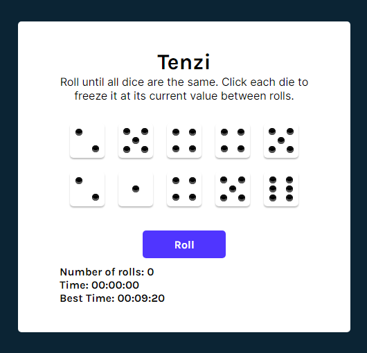

# Tenzi

## Project Origin
This project was made during the fourth module of the React course on Scrimba.
You can check the whole course [here](https://scrimba.com/learn/learnreact)

    

## How to play
Everyone gets ten dice. When signalled to start, you roll all your dice untill you get the same number on every one of them and shouts "TENZI!".

You can hold dice and roll the rest to get the same number of the dice you are holding.

Your objective in the game is to be fast and shout "Tenzi" first than everyone else, but since this game is offline, you should aim to get a fast time.

## Todo List

- [x] Die Component
    - [x] Update Die Component
- [x] Generate 10 random numbers
- [x] Map array to die component
- [x] Roll dice button
- [x] Hold dice
    - [x] Block held dice on rolls
- [x] End Game
- [x] New Game
- [x] Put dots on the dice
- [x] Track the number of rolls
- [x] Track the time it took to win
- [ ] Save best time to localStorage